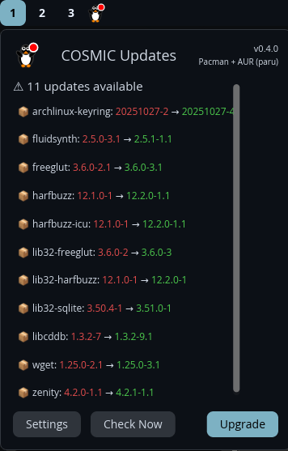
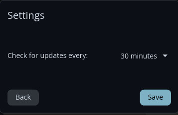

# COSMIC Updates

A universal package update checker applet for COSMIC Desktop that supports multiple package managers with AUR support and configurable settings.


*Main view showing available updates with color-coded versions*


*Settings view with configurable check intervals*

## Features

- 🧊 Custom penguin icons that change when updates are available
- 📦 **Multi-distro support**: Works with APT (Debian/Ubuntu/Pop!_OS) and Pacman (Arch/Manjaro/CachyOS)
- 🎨 **Color-coded version numbers** (red for old, green for new)
- 🔵 **AUR support** - Automatically detects and uses `paru` or `yay` for AUR packages
- 🏷️ **[AUR] badges** - Visual indicators for packages from the Arch User Repository
- 📊 **Separate counters** - Shows "X official + Y AUR" breakdown
- ⚙️ **Settings UI** - Configure update check intervals (5-120 minutes)
- 💾 **Config file** - Persistent settings at `~/.config/cosmic-updates/config.toml`
- 📜 Scrollable package list for large updates
- ⚡ One-click upgrade with terminal progress
- 🔐 Secure privilege escalation with pkexec
- 🏷️ Package manager display in header
- 🔍 Auto-detects your package manager at runtime

## Supported Distributions

### APT-based:
- Pop!_OS ✅
- Ubuntu ✅
- Debian ✅
- Linux Mint ✅

### Pacman-based (with optional AUR):
- CachyOS ✅ (Official repos + AUR via paru/yay)
- Arch Linux ✅ (Official repos + AUR via paru/yay)
- Manjaro ✅ (Official repos + AUR via paru/yay)
- EndeavourOS ✅ (Official repos + AUR via paru/yay)

**AUR Support:** The applet automatically detects if you have `paru` or `yay` installed and includes AUR package updates. Preference order: `paru` > `yay` > `pacman-only`.

## Installation

### Arch Linux / CachyOS / Manjaro

#### From AUR (Recommended)

**Pre-compiled binary version (fastest):**
```bash
yay -S cosmic-updates-bin
# or
paru -S cosmic-updates-bin
```

**Build from source:**
```bash
yay -S cosmic-updates-git
# or
paru -S cosmic-updates-git
```

#### Manual Build from Source
```bash
git clone https://codeberg.org/VintageTechie/cosmic-updates.git
cd cosmic-updates
cargo install just
just install
```

### Pop!_OS / Ubuntu / Debian

#### Option 1: APT Repository (Recommended)

Add the repository for automatic updates:
```bash
echo "deb [arch=amd64 trusted=yes] https://vintagetechie.codeberg.page/cosmic-updates stable main" | sudo tee /etc/apt/sources.list.d/cosmic-updates.list
sudo apt update
sudo apt install cosmic-updates
```

#### Option 2: Direct .deb Download

**[📥 Download cosmic-updates_0.4.0_amd64.deb](https://vintagetechie.codeberg.page/cosmic-updates/pool/main/cosmic-updates_0.4.0_amd64.deb)**
```bash
wget https://vintagetechie.codeberg.page/cosmic-updates/pool/main/cosmic-updates_0.4.0_amd64.deb
sudo apt install ./cosmic-updates_0.4.0_amd64.deb
```

### Add to Panel

After installation:
- Open COSMIC Settings
- Go to Desktop → Panel → Configure panel applets
- Click **Add applet**
- Find **"Updates"** in the applets list
- Click to add it to your panel

That's it! 🎉

## Usage

### Main View
- **Normal penguin** 🧊 = System is up to date
- **Alert penguin** 🧊⚠ = Updates available!
- Click the icon to see updates with **color-coded versions**:
  - 🔴 **Red** = Current version (what you have)
  - 🟢 **Green** = New version (what's available)
  - 🔵 **[AUR]** = Package from Arch User Repository
- Scroll through long update lists
- Click "Upgrade" to install (opens terminal)
- Click "Check Now" for manual check
- Click "Settings" to configure

### Settings

Configure the applet's behavior:

1. Click the applet icon
2. Click "Settings" button
3. Choose your preferred check interval:
   - 5, 10, 15, 20, 30, 45, 60, 90, or 120 minutes
4. Click "Save" to apply changes

Settings are saved to `~/.config/cosmic-updates/config.toml`

### Package Manager Detection

The applet automatically detects your system's package manager:
- **APT systems**: Uses `apt list --upgradable` and `apt upgrade`
- **Pacman systems**: Uses `checkupdates` and `pacman -Syu`
- **Pacman + paru**: Uses `checkupdates` + `paru -Qua` (combined view)
- **Pacman + yay**: Uses `checkupdates` + `yay -Qua` (combined view)

No manual configuration needed! 🎯

## Uninstalling

### APT-based systems:
```bash
sudo apt remove cosmic-updates
```

### Pacman-based systems:
```bash
yay -R cosmic-updates-bin
# or
paru -R cosmic-updates-bin
# or if built from source:
just uninstall
```

## Building from Source

### Prerequisites
- Rust toolchain (latest stable)
- libcosmic development libraries
- COSMIC Desktop Environment

### Build Instructions
```bash
git clone https://codeberg.org/VintageTechie/cosmic-updates.git
cd cosmic-updates
cargo build --release
just install
```

### Development Commands (using just)
```bash
just build          # Build release binary
just install        # Install to system
just restart-panel  # Restart COSMIC panel
just debug          # Run with debug mode (fake packages)
just check          # Run cargo check
just lint           # Run cargo clippy
just fmt            # Format code
just clean          # Clean build artifacts
```

### Debug Mode
Test with fake packages:
```bash
DEBUG_APT_CHECKER=1 cosmic-panel
```

## Architecture

### Module Structure
```
src/
├── main.rs                    # Main applet code
├── config.rs                  # Configuration management
└── package_manager/
    ├── mod.rs                 # Package manager trait & enum
    ├── apt.rs                 # APT implementation
    ├── pacman.rs              # Pacman implementation (official repos)
    ├── yay.rs                 # Yay AUR helper implementation
    └── paru.rs                # Paru AUR helper implementation
```

### Adding New Package Managers

To add support for a new package manager:

1. Create a new file in `src/package_manager/` (e.g., `dnf.rs`)
2. Implement these async methods:
   - `check_updates()` - List available updates
   - `run_upgrade()` - Launch upgrade in terminal
   - `is_running()` - Check if package manager is running
   - `name()` - Return package manager name
   - `refresh_cache()` - Refresh package database
3. Add detection in `mod.rs::detect_package_manager()`
4. Add variant to `PackageManager` enum

See `apt.rs`, `pacman.rs`, or `paru.rs` for examples.

## Changelog

### Version 0.4.0 (2025-11-08)
- 🎉 **AUR Support** - Automatic detection and integration of paru/yay
- 🔵 **[AUR] badges** - Visual indicators for AUR packages
- 📊 **Separate counters** - Shows "X official + Y AUR" breakdown
- ⚙️ **Settings UI** - Configure update check intervals
- 💾 **Config file** - Persistent settings at `~/.config/cosmic-updates/config.toml`
- 🎨 **Improved header** - Shows active package manager name
- 📦 **Published to AUR** - `cosmic-updates-bin` and `cosmic-updates-git`
- 🔧 **Check intervals** - Choose from 5, 10, 15, 20, 30, 45, 60, 90, or 120 minutes
- 🎯 **Smart detection** - Prefers paru > yay > pacman-only

### Version 0.4.0 (2025-11-07)
- 🎉 **Multi-package manager support** - APT and Pacman!
- 🔄 **Renamed to cosmic-updates** - Universal support
- 🗂️ **Refactored architecture** - Modular design
- 🔍 **Auto-detection** - Detects package manager
- 🆔 **Updated APP_ID** - `com.vintagetechie.CosmicUpdates`
- 📦 **Arch/CachyOS support** - Full Pacman integration

### Version 0.2.0 (2025-11-06)
- 🎨 Color-coded version numbers
- 📜 Scrollable package list
- 🏷️ Version display in header
- 🎯 Fixed icon alignment

### Version 0.1.x (2025-11-05)
- Initial releases as cosmic-apt-checker
- Basic APT functionality

## Contributing

Contributions welcome! 

- **Bug reports**: Open an issue on [Codeberg](https://codeberg.org/VintageTechie/cosmic-updates/issues)
- **Code contributions**: Fork, create feature branch, test, submit PR
- **New package managers**: See "Adding New Package Managers" above

## License

MIT License - see [LICENSE](LICENSE)

## Credits

Developed by [VintageTechie](https://vintagetechie.com) for the COSMIC community 🚀

Built with [Rust](https://www.rust-lang.org/) 🦀 and [libcosmic](https://github.com/pop-os/libcosmic)

### Support Development

[](https://ko-fi.com/vintagetechie)

## Links

- **Website:** https://vintagetechie.com
- **Source:** https://codeberg.org/VintageTechie/cosmic-updates
- **APT Repo:** https://vintagetechie.codeberg.page/cosmic-updates
- **AUR Package (bin):** https://aur.archlinux.org/packages/cosmic-updates-bin
- **AUR Package (git):** https://aur.archlinux.org/packages/cosmic-updates-git
- **Issues:** https://codeberg.org/VintageTechie/cosmic-updates/issues

## Roadmap

### 🎯 Near-Term (v0.5.x)

#### Flatpak Distribution
- [ ] Create Flatpak manifest
- [ ] Test with COSMIC Flatpak environment
- [ ] Submit to System76's COSMIC Flatpak repository
- [ ] Eventually submit to Flathub

#### Package Distribution
- [ ] RPM packages for Fedora
- [ ] openSUSE packages

### 🚀 Mid-Term (v0.6.x)

#### Additional Package Managers
- [ ] DNF support (Fedora, RHEL, CentOS)
- [ ] Zypper support (openSUSE, SUSE)
- [ ] Nix package manager support
- [ ] Snap support
- [ ] AppImage update checking

### ✨ Long-Term Features

#### Smart Notifications (v0.7.x)
- [ ] Desktop notifications when updates available
- [ ] Configurable notification frequency
- [ ] System restart alerts (kernel/critical updates)
- [ ] Update categories (security vs regular)
- [ ] Silent mode option
- [ ] Only notify on count changes (avoid spam)

#### Enhanced Update Management
- [ ] One-click upgrade (no terminal needed)
- [ ] Progress indicators during updates
- [ ] Update history/changelog viewer
- [ ] Failed update recovery
- [ ] Rollback capability
- [ ] Selective package updates (pick which to install)

#### Scheduling & Automation
- [ ] Schedule updates for specific times
- [ ] Auto-update option for security patches
- [ ] Update reminders

#### UI/UX Improvements
- [ ] Multiple icon themes
- [ ] Package details popup (size, dependencies, changelog)
- [ ] Search/filter in update list
- [ ] Tooltips with package descriptions
- [ ] Keyboard shortcuts
- [ ] Different view modes (compact/detailed)

#### Advanced Features
- [ ] Update statistics and analytics
- [ ] Bandwidth usage monitoring
- [ ] Mirror selection/optimization
- [ ] Multiple language support (i18n)
- [ ] Integration with system logs
- [ ] Export update reports

### ✅ Completed

#### AUR Support (v0.4.0) ✅
- ✅ Detect AUR helpers (`yay`, `paru`)
- ✅ Check AUR package updates separately
- ✅ Combine official repo + AUR updates in one view
- ✅ Show AUR packages with special indicator ([AUR] badge)
- ✅ Handle AUR helper configuration (auto-detection)
- ✅ Publish AUR package (`cosmic-updates-bin`)
- ✅ Publish AUR git package (`cosmic-updates-git`)

#### Settings UI (v0.4.0) ✅
- ✅ Settings panel for configuration
- ✅ Configurable auto-check interval (5-120 minutes)
- ✅ Config file management

---

Made with ❤️ for the COSMIC Desktop community